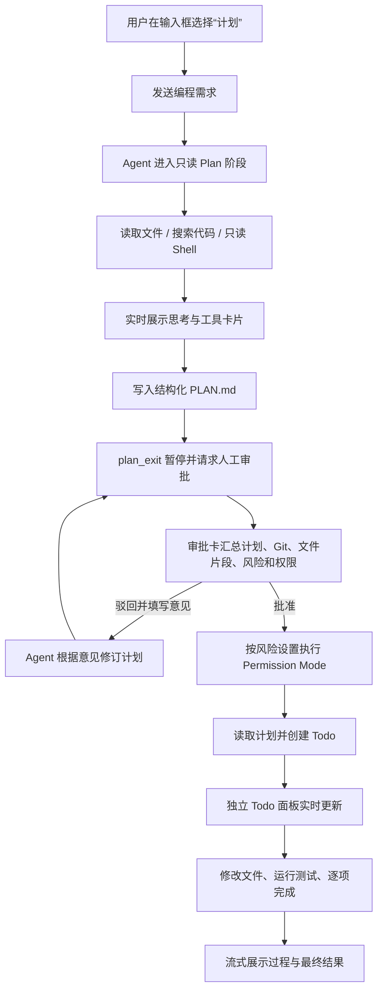

# AgentScope Plan Mode 成果介绍与演示手册

> 适用场景：项目介绍、技术分享、产品演示、阶段验收  
> 关联设计文档：[AgentScope_PlanMode_编程场景优化指南.md](./AgentScope_PlanMode_编程场景优化指南.md)

## 一句话介绍

我为 Alibaba Copilot 增加了一套面向编程任务的 Plan Mode：Agent 先以只读方式理解代码、形成可审查的实施计划，获得人工批准后，再按风险等级选择执行权限并逐项完成任务。

它解决的不是“让模型多想一会儿”，而是把一次不透明的代码生成，变成一个可观察、可审查、可驳回、可继续执行的工程流程。

## 30 秒介绍话术

> 原来的编程 Agent 收到需求后会直接开始改文件，用户很难提前知道它准备改什么、为什么这么改，以及风险在哪里。我参考 Codex 的交互方式，在输入框增加了“计划”模式。开启后，Agent 先只读探索项目，通过实时卡片展示分析和工具调用，再生成结构化计划。审批卡会同时给出影响文件、改前代码片段、Git 状态、风险等级和执行权限。用户可以批准执行，也可以带意见驳回让 Agent 修订计划。这样既保留了 Agent 自动完成任务的效率，又把关键决策权交还给用户。

## 我完成了什么

| 能力 | 用户价值 | 当前实现 |
|---|---|---|
| Chat / Plan 模式切换 | 普通问答保持轻量，复杂编程任务按需进入计划流程 | 输入框内提供“计划”入口，请求携带 `planMode` |
| 只读代码探索 | 计划阶段不会提前修改业务文件 | 允许读文件、搜索及受约束的只读 Shell 探索 |
| 实时过程卡片 | 不再长时间只显示“正在处理” | 流式展示 reasoning、工具名称、参数、状态和结果 |
| 结构化 `PLAN.md` | 计划可读、可存档、可复查 | 固定包含任务理解、方案、变更清单、测试、风险和回滚 |
| 人工审批（HITL） | 批准前不进入执行阶段 | `plan_exit` 暂停运行，前端显示审批卡 |
| 带意见驳回 | 用户无需重新描述整个需求 | 驳回意见回传给同一会话，Agent 修订后再次请求审批 |
| 审批上下文 | 用户能够基于代码现状做决定 | 展示影响文件、Git 状态及最多 5 个改前文件片段 |
| 风险分级执行 | 低风险自动化，高风险保留确认 | LOW / MEDIUM / HIGH 映射到不同 Permission Mode |
| 任务化执行 | 批准后按步骤推进，不再一次性盲改 | 使用 Todo 列表组织 5–8 个可独立验证的任务 |
| 独立 Todo 进度面板 | 实时看到总进度、当前任务和已完成项 | 从 `todo_write` 流式快照解析任务状态、优先级和完成比例 |
| 会话隔离与恢复 | 多个任务互不污染，审批后可继续原进度 | 每个 conversation 使用独立 workspace、plan 和 Agent state |

## 完整工作流



## 三档风险策略

风险判断来自计划正文，审批卡会把风险和批准后的策略直接展示给用户。

| 风险 | 典型内容 | AgentScope Permission Mode | 行为 |
|---|---|---|---|
| LOW | 局部代码修改、补充测试、样式调整 | `BYPASS` | 批准后自动执行；显式拒绝规则仍然有效 |
| MEDIUM | 外部 API、数据库操作、并发或线程安全 | `DONT_ASK` | 需要额外授权的操作直接拒绝，避免无人值守时挂起 |
| HIGH | migration、删除、强推、不可逆操作 | `DEFAULT` | 敏感操作继续请求人工确认，默认保持安全边界 |

说明：Plan 阶段本身始终是只读的。上述策略只在用户批准计划、进入执行阶段时生效。

## Plan 阶段的 Shell 边界

为了让 Agent 能像开发者一样快速理解项目，我开放了 Plan 阶段的只读 Shell，但同时通过系统约束限制命令范围。

允许的典型命令：

```text
pwd
ls
cat / head / tail
sed -n
grep / rg / find
git status / log / diff / show
mvn test / gradle test / npm test / pnpm test
```

禁止的典型操作：

```text
重定向写文件、tee、sed -i
rm、mv、cp、touch、mkdir
安装依赖、数据库写入、网络写操作
git add、commit、push、reset、checkout
使用管道、子 Shell 或脚本包装绕过限制
```

## 核心技术链路

```text
React 输入框
  → POST /api/chat（planMode / planAction / planFeedback）
  → ChatServiceImpl
  → HarnessAgent + PlanMode + TaskList + Filesystem + Shell
  → AG-UI 事件流
  → SSE
  → reasoning / tool / plan-review / plan-status 卡片
```

关键实现位置：

| 文件 | 作用 |
|---|---|
| `ui-react/src/components/AiChat/index.tsx` | Chat / Plan 模式状态和审批请求 |
| `ui-react/src/components/AiChat/input-area/index.tsx` | 输入框内的计划模式入口 |
| `ui-react/src/components/AiChat/chat/components/MessageItem/index.tsx` | 过程卡片、审批卡、Git 与文件片段展示 |
| `copilot-modules/copilot-context/.../ChatServiceImpl.java` | Plan 生命周期、SSE、审批上下文和风险权限 |
| `copilot-modules/copilot-context/.../CopilotAgentFactory.java` | HarnessAgent、Plan、Todo、只读 Shell 与 Prompt 配置 |
| `copilot-modules/copilot-context/.../PlanApprovalAgent.java` | 将批准或驳回结果接回暂停中的 `plan_exit` |

## 推荐演示方案（8 分钟）

### 演示前准备

- 后端和前端已启动，页面能够正常登录。
- 自定义模型供应商已检测通过。
- 准备一个包含 2–3 个源文件和基础测试的会话工作区。
- 浏览器开发者工具可以关闭，避免遮挡核心界面。
- 提前做一次同样的任务，确认中转模型当前响应稳定。

推荐示例任务：

```text
请给当前项目的用户列表增加名称搜索功能，要求：
1. 输入停止 300ms 后再搜索；
2. 保留现有分页行为；
3. 补充空结果状态；
4. 不修改后端接口。
先分析现有实现，再给出计划。
```

这个任务规模适中，能够自然产生文件探索、方案权衡、影响文件、测试策略和低/中风险判断。

### 第 1 步：展示入口（约 30 秒）

操作：

1. 打开 Builder 页面。
2. 点击输入框底部的模式选择。
3. 从普通模式切换到“计划”。

讲解：

> 计划模式不是全局强制开启的。简单问答仍然走普通模式；只有涉及多个文件、存在风险或需要先对齐方案的任务，用户才主动进入 Plan Mode。

### 第 2 步：展示只读探索与实时过程（约 1 分钟）

操作：发送示例任务，观察消息区。

重点指出：

- “Agent 正在处理”的状态会随事件推进；
- reasoning 卡片持续增长；
- 读文件、搜索、执行只读命令会形成独立工具卡片；
- 工具卡会从运行中更新为完成或失败，而不是重复堆叠。

讲解：

> 这一步 Agent 只能理解项目，不能修改业务文件。中间事件通过 AG-UI 和 SSE 实时到达前端，所以用户可以看到它读了什么、调用了什么工具、当前做到哪一步。

### 第 3 步：展示审批卡（约 2 分钟）

计划生成后，依次介绍：

1. 结构化计划正文；
2. 预计影响文件；
3. 当前 Git 状态；
4. “改前文件片段”折叠区；
5. 风险徽标；
6. 批准后的 Permission Mode 和中文策略说明。

讲解：

> 审批不是只看一段模型生成的文字。这里把代码现场一起带到了审批卡：现在工作区是否有未提交修改、计划提到的文件原来是什么样、该计划会采用什么执行权限，用户在批准前都能看见。

### 第 4 步：演示驳回修订（约 1 分钟）

操作：

1. 点击“驳回修改”。
2. 输入：

```text
不要引入新的第三方依赖；请补充防抖定时器的清理方式，并增加一个快速连续输入的测试场景。
```

3. 提交修改意见。

讲解：

> 驳回不会丢失上下文，也不需要重新发起任务。意见会回到同一个 Agent 会话，它会基于原计划继续修订，之后再次进入审批。

### 第 5 步：批准并执行（约 2 分钟）

操作：确认新计划符合要求后，点击“批准并执行”。

重点观察：

- 按钮立即进入已提交状态，避免重复审批；
- 状态提示说明执行阶段和权限策略；
- Agent 读取已批准的 `PLAN.md`；
- 创建 Todo 后出现独立任务进度面板；
- 面板显示完成比例、进行中任务、优先级和已完成划线状态；
- Agent 逐项修改和验证时，面板随 `todo_write` 快照实时更新；
- 工具调用与结果持续展示；
- 最终输出完成说明。

讲解：

> 批准动作会接回之前暂停的 `plan_exit`，不是重新启动一个失去上下文的模型调用。执行前系统还会根据风险等级设置 Permission Mode，然后 Agent 按 Todo 逐项落地和验证。

### 第 6 步：总结（约 30 秒）

> 这套能力把编程 Agent 拆成“探索—计划—审批—执行—验证”五个可观察阶段。低风险任务仍然可以高效自动完成，高风险任务则保留人工确认，兼顾效率、可控性和可追溯性。

## 演示时应该强调的四个亮点

1. **不是 Prompt 演戏**：`plan_exit` 会真实暂停 Agent，批准前不会进入执行阶段。
2. **不是黑盒等待**：reasoning 和工具调用通过 AG-UI 实时展示。
3. **不是盲目审批**：计划、Git 状态、改前代码、风险和权限在同一张卡片中。
4. **不是批准后放飞**：不同风险对应不同 Permission Mode，高风险操作仍需人工确认。
5. **不是只看最终结果**：独立 Todo 面板持续显示当前执行位置和总体完成比例。

## 演示异常预案

### 模型响应较慢

话术：

> 当前过程是模型实时生成并通过中转站流式返回。界面会持续展示已经到达的 reasoning 和工具事件，不需要等到整轮完成才看到结果。

如果等待时间过长，换成更小的任务：

```text
分析当前页面的空状态实现，给出只修改一个组件的优化计划，不要执行。
```

### 工具调用失败

话术：

> 工具失败也会成为可见事件，而不是被界面吞掉。Agent 可以根据错误修正参数；连续无新事件时，系统会结束任务并给出明确错误，避免无限卡住。

### 审批卡没有文件片段

先确认计划中的文件路径是相对于当前会话工作区的真实路径。新文件或工作区外路径会明确显示“当前不存在”或“超出会话工作区”，这是安全边界，不是静默失败。

### 高风险计划批准后再次请求确认

这是预期行为。高风险计划使用 `DEFAULT` 权限，计划批准代表同意总体方案，不等于自动授权所有不可逆操作。

## 常见问题

### 普通聊天会受影响吗？

不会。Plan Mode 是输入框中的可选模式；未开启时仍按普通对话和构建流程运行。

### 为什么计划阶段还允许 Shell？

大型项目仅靠逐个读文件效率较低。只读 Shell 能快速完成目录查看、全文搜索、Git 差异和测试验证；写操作仍然被明确禁止。

### 风险识别是不是绝对准确？

当前采用可解释的规则对计划文字进行分级，并在界面上公开结果和执行策略。它是执行权限的第一层防线，不替代工具本身的显式拒绝规则和高风险人工确认。

### 驳回是不是重新开始一轮？

不是。系统保存 Agent state，并把驳回意见作为 `plan_exit` 的人工确认结果送回原会话，Agent 在原上下文上继续修订。

### 为什么审批卡最多展示 5 个文件片段？

为了控制 SSE 负载和审批卡长度。计划正文仍会列出全部影响文件；卡片优先提供有限、可阅读的关键现场，单个片段最多展示 32 行。

### Git 状态为什么可能显示“不是 Git 仓库”？

Agent 使用会话隔离工作区。该工作区没有初始化 Git 时，系统会明确提示；这不会影响计划和执行，只是没有 Git 现场可供审批。

## 当前边界与后续方向

当前版本已经打通单 Agent 的完整 Plan Mode 主链路，并完成独立 Todo 进度面板。后续可以继续增强：

- 为高风险工具增加更细粒度的专用确认卡；
- 把风险规则升级为“规则 + 模型结构化判断 + 工具参数”联合评估；
- 增加 Planner / Executor 多 Agent 分工与子任务结果汇总；
- 增加管理端 Plan / Tasks 状态查询和人工干预接口；
- 为计划、审批和执行记录增加持久化、历史查询与审计报表；
- 支持团队级权限策略。

这些属于增强项，不影响当前“只读探索—计划—审批—执行”的闭环演示。

## 演示检查清单

演示前：

- [ ] 前后端服务已启动
- [ ] 自定义供应商检测成功
- [ ] 准备好有现存文件的会话工作区
- [ ] 示例需求已复制到剪贴板
- [ ] Plan 模式入口可见
- [ ] 浏览器缩放和窗口大小适合投屏

演示中：

- [ ] 指出当前处于只读阶段
- [ ] 展示至少一个 reasoning 卡和一个工具卡
- [ ] 展开一个改前文件片段
- [ ] 解释风险等级与 Permission Mode
- [ ] 至少演示一次驳回
- [ ] 批准后观察独立 Todo 面板、完成比例和执行过程
- [ ] 展示最终结果或测试结果

演示后：

- [ ] 回到五阶段闭环做总结
- [ ] 说明高风险仍保留人工确认
- [ ] 根据听众情况选择是否展开技术链路

## 一分钟收尾话术

> 我完成的不只是一个“先输出计划”的按钮，而是一套真实可暂停、可审批、可恢复的 Agent 执行机制。计划阶段通过文件读取、代码搜索和受约束的只读 Shell 获取上下文；审批时把计划、Git、原代码、风险和权限放到一起；用户驳回后可以原地修订，批准后再按风险策略执行。整个过程通过 AG-UI 流式可视化，并保存会话状态。最终效果是：简单任务不增加负担，复杂任务不再盲目执行，高风险任务不失控。
