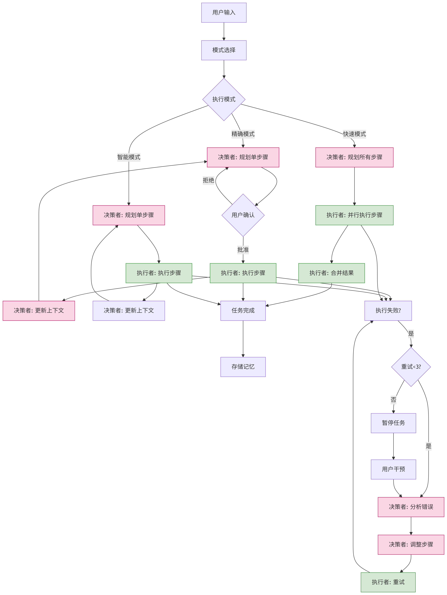

# AI编码助手 (AI Copilot)

基于Spring AI + Vue3的智能编码助手，支持任务规划、分步执行和实时反馈。

## 🚀 项目特性

### 核心功能
- **智能任务分解**: 将复杂的编码需求分解为可执行的步骤序列
- **分步执行**: 每次只执行一个步骤，根据结果动态规划下一步
- **实时反馈**: 通过SSE提供任务执行的实时状态更新
- **模板驱动**: 基于预定义模板快速生成项目结构
- **多工具集成**: 支持文件操作、代码生成、项目模板等多种工具

### 技术架构
- **后端**: Spring Boot + Spring AI + MCP工具集成
- **前端**: Vue3 + Ant Design Vue + TypeScript
- **通信**: RESTful API + Server-Sent Events (SSE)
- **AI模型**: 支持多种LLM模型（通过Spring AI）

### 流程示例

<p align="center">
     
</p>

## 📋 系统要求

- Java 17+
- Node.js 16+
- Maven 3.6+
- Git

## 🛠️ 快速开始

### 1. 克隆项目
```bash
git clone <repository-url>
cd spring-ai-alibaba-copilot
```

### 2. 配置环境
在 `src/main/resources/application.properties` 中配置AI模型：
```properties
# AI模型配置
spring.ai.openai.api-key=your-api-key
spring.ai.openai.base-url=https://dashscope.aliyuncs.com
```

### 3. 构建前端
```bash
安装依赖 npm install

运行项目 npm run dev

```

### 4. 启动应用
```bash
mvn spring-boot:run
```

### 5. 访问应用
打开浏览器访问: http://localhost:8080

## 🎯 使用指南

### 创建任务
1. 在主界面输入您的编码需求
2. 可以选择快速模板或查看示例需求
3. 点击"开始执行"创建任务

### 监控执行
- 实时查看任务执行进度
- 查看每个步骤的详细信息
- 监控执行日志

### 管理任务
- 查看任务历史
- 管理活跃任务
- 取消或重试失败的任务

## 🔧 配置说明

### MCP工具配置
在 `src/main/resources/mcp-servers-config.json` 中配置MCP工具：

```json
{
  "mcpServers": {
    "mcp-server-filesystem": {
      "command": "npx",
      "args": ["-y", "@modelcontextprotocol/server-filesystem", "./generated-projects"]
    },
    "mcp-server-git": {
      "command": "npx",
      "args": ["-y", "@modelcontextprotocol/server-git"]
    }
  }
}
```

## 📝 API文档

### 任务管理API

#### 创建任务
```http
POST /api/task/create
Content-Type: application/json

{
  "query": "创建一个Spring Boot项目"
}
```

#### 获取任务状态
```http
GET /api/task/status/{taskId}
```

#### 取消任务
```http
POST /api/task/cancel/{taskId}
```

#### SSE连接
```http
GET /api/task/stream/{taskId}?clientId=web-client
```

## 🤝 贡献指南

1. Fork 项目
2. 创建特性分支 (`git checkout -b feature/AmazingFeature`)
3. 提交更改 (`git commit -m 'Add some AmazingFeature'`)
4. 推送到分支 (`git push origin feature/AmazingFeature`)
5. 打开 Pull Request

## 📄 许可证

本项目采用 Apache License 2.0 许可证 - 查看 [LICENSE](LICENSE) 文件了解详情。
