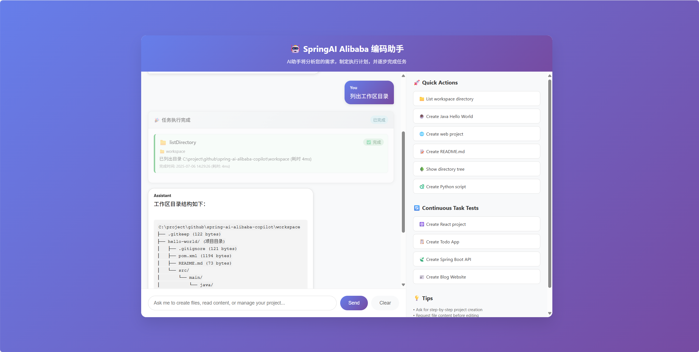
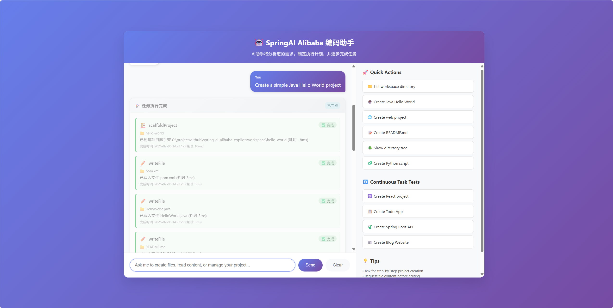
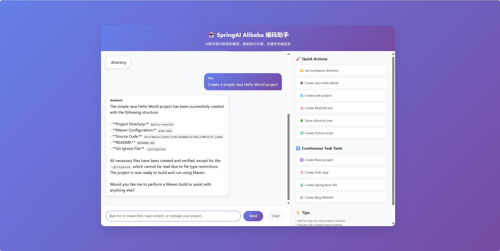
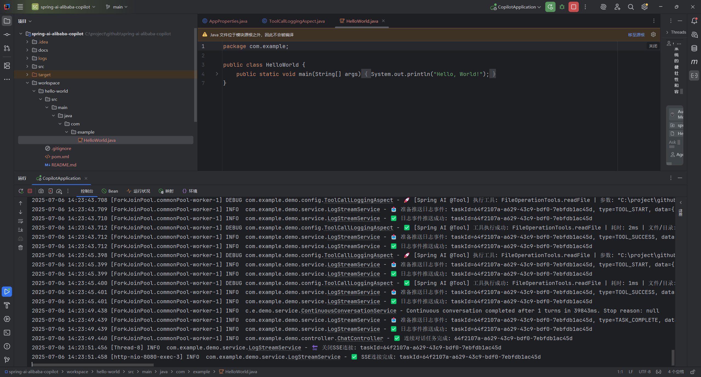

# 🤖 AI编码助手 (Spring AI Alibaba Copilot)

基于Spring AI框架构建的智能编码助手，集成MCP工具协议，支持项目分析、代码生成、智能编辑和项目脚手架等功能。通过自然语言交互，帮助开发者快速完成各种编程任务。

## ✨ 项目亮点

- 🧠 **智能项目分析**: 自动识别项目类型、分析依赖关系和代码结构
- 🛠️ **多工具集成**: 集成文件操作、项目脚手架、智能编辑等多种工具
- 🔄 **连续任务执行**: 支持复杂任务的分步执行和状态跟踪
- 📡 **实时反馈**: 基于SSE的实时日志流和任务状态更新
- 🎯 **模板驱动**: 支持多种项目类型的快速脚手架生成

## 🚀 核心功能

### 🔍 项目分析工具
- **项目类型检测**: 自动识别Java Maven、Spring Boot、Node.js、React、Python等项目类型
- **依赖分析**: 解析pom.xml、package.json、requirements.txt等依赖文件
- **结构分析**: 分析项目目录结构、文件统计和代码度量
- **配置文件发现**: 自动发现和分析各类配置文件

### 📝 智能编辑工具
- **文件操作**: 读取、写入、编辑文件，支持大文件分页处理
- **智能编辑**: 基于自然语言描述进行精确的代码修改
- **差异预览**: 提供编辑前后的详细差异对比
- **目录管理**: 递归目录列表、结构浏览

### 🏗️ 项目脚手架
- **多框架支持**: Spring Boot、React、Vue、Node.js、Python等
- **模板定制**: 支持自定义项目模板和变量替换
- **结构生成**: 自动创建标准的项目目录结构
- **配置文件生成**: 自动生成相应的配置文件和依赖声明

### 📊 任务管理
- **任务状态跟踪**: 实时监控任务执行进度和状态
- **SSE流式推送**: 通过Server-Sent Events推送实时日志
- **错误处理**: 完善的错误捕获和恢复机制
- **历史记录**: 任务执行历史和结果查询

## 🏗️ 技术架构

### 后端技术栈
- **Spring Boot 3.4.5**: 应用框架
- **Spring AI 1.0.0**: AI集成框架，支持多种LLM模型
- **MCP Client**: Model Context Protocol客户端集成
- **AspectJ**: AOP切面编程，用于工具调用监控
- **Jackson**: JSON处理
- **Java Diff Utils**: 文件差异比较

### 前端技术栈
- **原生JavaScript**: 轻量级前端实现
- **Server-Sent Events**: 实时数据推送
- **CSS3**: 现代化UI样式
- **Thymeleaf**: 服务端模板引擎

### 核心组件
- **工具系统**: 基于Spring AI @Tool注解的工具集成
- **项目分析引擎**: 多语言项目类型检测和分析
- **模板引擎**: 项目脚手架模板生成系统
- **日志流系统**: 基于SSE的实时日志推送

### 🖼️ 界面展示(演示效果基于qwen-plus模型)

#### 聊天交互界面
<p align="center">
    
    
</p>

<p align="center">
    
    
</p>


### 📹 演示视频

<p align="center">
    
</p>

## 📋 系统要求

- **Java 17+**: 核心运行环境
- **Maven 3.6+**: 项目构建工具
- **Git**: 版本控制（可选）
- **Node.js 16+**: MCP工具运行环境（可选）

## 🛠️ 快速开始

### 1. 克隆项目
```bash
git clone https://github.com/springaialibaba/spring-ai-alibaba-copilot.git
cd spring-ai-alibaba-copilot
```

### 2. 配置AI模型
编辑 `src/main/resources/application.yml` 配置文件：

```yaml
spring:
  ai:
    openai:
      # 配置您的AI模型API
      base-url: https://dashscope.aliyuncs.com
      api-key: your-api-key-here
      chat:
        options:
          model: your-model-name  # 如: qwen-plus, deepseek-v3等
```

### 3. 配置工作目录
```yaml
app:
  workspace:
    root-directory: ${user.dir}/workspace  # 工作目录路径
    max-file-size: 10485760  # 最大文件大小 (10MB)
    allowed-extensions:  # 允许的文件扩展名
      - .txt
      - .md
      - .java
      - .js
      - .json
      # ... 更多扩展名
```

### 4. 启动应用
```bash
# 使用Maven启动
mvn spring-boot:run

# 或者先编译再运行
mvn clean package
java -jar target/spring-ai-alibaba-copilot-1.0.0.jar
```

### 5. 访问应用
- 应用会自动在浏览器中打开: http://localhost:8080
- 如果未自动打开，请手动访问上述地址

## 🎯 使用指南

### 📝 使用示例

#### 项目分析
```
分析当前工作目录下的项目结构和依赖关系
```

#### 创建新项目
```
创建一个Spring Boot项目，包含REST API和数据库配置
```

#### 文件操作
```
读取src/main/java/Application.java文件的内容
```

#### 智能编辑
```
在Application.java中添加一个新的REST控制器方法
```

### 🚀 快速操作模板
应用提供了多个快速操作模板：
- ⚛️ **创建React项目**: 完整的React项目结构
- 📋 **创建Todo应用**: 全栈Todo应用
- 🍃 **创建Spring Boot API**: REST API项目
- 📰 **创建博客网站**: 静态博客网站

### 📊 任务监控
- **实时状态**: 查看任务执行状态和进度
- **日志流**: 通过SSE接收实时执行日志
- **错误处理**: 自动错误检测和恢复建议

## ⚙️ 详细配置

### 📁 工作目录配置
```yaml
app:
  workspace:
    root-directory: ${user.dir}/workspace  # 工作目录
    max-file-size: 10485760  # 最大文件大小限制
    allowed-extensions:  # 允许操作的文件类型
      - .txt
      - .md
      - .java
      - .js
      - .ts
      - .json
      - .xml
      - .yml
      - .yaml
      - .properties
      - .html
      - .css
      - .sql
```

### 🛠️ 工具配置
```yaml
app:
  tools:
    read-file:
      enabled: true
      max-lines-per-read: 1000  # 单次读取最大行数
    write-file:
      enabled: true
      backup-enabled: true  # 是否启用文件备份
    edit-file:
      enabled: true
      diff-context-lines: 3  # 差异显示上下文行数
    list-directory:
      enabled: true
      max-depth: 5  # 目录遍历最大深度
```

### 🔒 安全配置
```yaml
app:
  security:
    approval-mode: DEFAULT  # DEFAULT, AUTO_EDIT, YOLO
    dangerous-commands:  # 危险命令列表
      - rm
      - del
      - format
      - fdisk
      - mkfs
```

### 🌐 浏览器配置
```yaml
app:
  browser:
    auto-open: true  # 启动后自动打开浏览器
    url: http://localhost:${server.port:8080}
    delay-seconds: 2  # 延迟打开时间
```

## 📚 API文档

### 🔄 任务管理API

#### 获取任务状态
```http
GET /api/task/status/{taskId}
```

**响应示例:**
```json
{
  "taskId": "task-123",
  "status": "RUNNING",
  "currentAction": "正在分析项目结构...",
  "summary": "项目分析任务",
  "currentTurn": 2,
  "totalEstimatedTurns": 5,
  "progressPercentage": 40.0,
  "elapsedTime": 15000,
  "errorMessage": null
}
```

#### 获取对话结果
```http
GET /api/task/result/{taskId}
```

**响应示例:**
```json
{
  "taskId": "task-123",
  "status": "COMPLETED",
  "result": "任务执行完成",
  "totalTurns": 5,
  "elapsedTime": 45000
}
```

### 📡 SSE日志流API

#### 建立SSE连接
```http
GET /api/logs/stream/{taskId}
Accept: text/event-stream
```

**事件格式:**
```
event: log
data: {"level":"INFO","message":"开始执行任务","timestamp":"2024-01-01T10:00:00Z"}

event: status
data: {"status":"RUNNING","progress":25}

event: complete
data: {"status":"COMPLETED","result":"任务完成"}
```

#### 关闭SSE连接
```http
POST /api/logs/close/{taskId}
```

#### 获取连接状态
```http
GET /api/logs/status
```

**响应示例:**
```json
{
  "activeConnections": 3,
  "status": "OK"
}
```

## 🛠️ 工具集成详解

### 📊 项目分析工具 (AnalyzeProjectTool)
- **功能**: 分析项目类型、依赖关系、代码结构
- **支持格式**: Maven、npm、Python、Go、Rust等
- **输出格式**: 详细报告、JSON格式、简要摘要

### 📝 文件操作工具 (FileOperationTools)
- **readFile**: 读取文件内容，支持分页
- **writeFile**: 创建或覆盖文件
- **editFile**: 智能编辑，支持差异预览
- **listDirectory**: 目录列表，支持递归

### 🏗️ 项目脚手架工具 (ProjectScaffoldTool)
- **支持类型**: Spring Boot、React、Vue、Node.js、Python等
- **模板变量**: 项目名称、作者、版本等自动替换
- **结构生成**: 标准目录结构和配置文件

### 🧠 智能编辑工具 (SmartEditTool)
- **自然语言**: 基于描述进行代码修改
- **上下文感知**: 理解项目结构和代码逻辑
- **安全编辑**: 提供编辑预览和确认机制

## 🔍 项目类型支持

| 项目类型 | 检测文件 | 依赖分析 | 脚手架支持 |
|---------|---------|---------|-----------|
| Java Maven | pom.xml | ✅ | ✅ |
| Spring Boot | pom.xml + @SpringBootApplication | ✅ | ✅ |
| Node.js | package.json | ✅ | ✅ |
| React | package.json + react依赖 | ✅ | ✅ |
| Vue | package.json + vue依赖 | ✅ | ✅ |
| Python | requirements.txt/setup.py | ✅ | ✅ |
| Django | manage.py | ✅ | ❌ |
| Flask | app.py | ✅ | ❌ |
| Go | go.mod | ✅ | ❌ |
| Rust | Cargo.toml | ✅ | ❌ |

## 🚀 高级功能

### 🔄 连续任务执行
- 支持复杂任务的分步执行
- 自动任务状态跟踪和进度更新
- 错误恢复和重试机制

### 📡 实时日志流
- 基于SSE的实时日志推送
- 多客户端连接支持
- 结构化日志格式

### 🎯 智能工具调用
- 基于Spring AI @Tool注解
- 自动参数验证和类型转换
- 详细的执行日志和监控

## 🤝 贡献指南

### 贡献流程
1. Fork 项目到您的GitHub账户
2. 创建特性分支 (`git checkout -b feature/AmazingFeature`)
3. 提交更改 (`git commit -m 'Add some AmazingFeature'`)
4. 推送到分支 (`git push origin feature/AmazingFeature`)
5. 创建 Pull Request

### 代码规范
- 遵循Java代码规范
- 添加适当的注释和文档
- 编写单元测试
- 确保所有测试通过

## 📄 许可证

本项目采用 Apache License 2.0 许可证 - 查看 [LICENSE](LICENSE) 文件了解详情。

## 🙏 致谢

- [Spring AI](https://spring.io/projects/spring-ai) - AI集成框架
- [Model Context Protocol](https://modelcontextprotocol.io/) - 工具协议标准

---

<p align="center">
  <strong>🌟 如果这个项目对您有帮助，请给我们一个Star！</strong>
</p>
