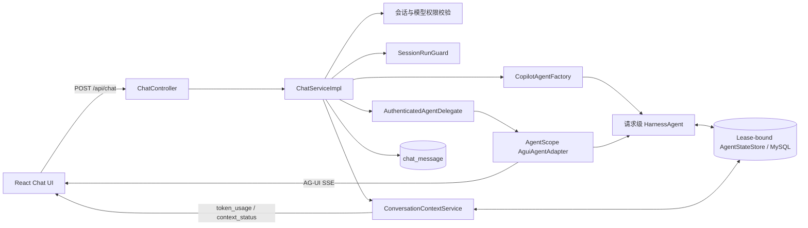

# AgentScope Java 2.0 上下文集成设计与实现

> 状态：上下文阶段已完整落地
>
> 范围：短期上下文、持久化、压缩、状态查询、重置、AG-UI 可观测性与完整前端交互
>
> 暂不包含：AgentScope Sandbox、长期记忆、RAG、Skill、子 Agent

## 1. 结论

AgentScope 能满足当前系统的会话上下文需求，不需要额外引入 Python Runtime 或独立上下文服务。
仓库已经使用 AgentScope Java `2.0.0`，本次直接复用以下能力：

- `RuntimeContext(userId, sessionId)`：隔离用户和会话。
- `AgentState` / `AgentStateStore`：保存模型下一轮实际读取的消息、工具状态和压缩摘要。
- `MysqlAgentStateStore`：跨请求、跨进程重启持久化上下文。
- `CompactionMiddleware`：长会话 token 阈值压缩。
- `AguiAgentAdapter`：继续输出现有 AG-UI SSE 协议。

AgentScope 是运行时能力层，不替代系统已有的登录鉴权、会话归属、模型权限、历史展示和业务数据。
上下文链路使用 JVM 内快速拒绝加 MySQL 租约的双层 session guard，同一业务库上的多个 Spring Boot
副本会按 `(userId, conversationId)` 串行化推理、重置和删除操作。

## 2. 责任边界

| 领域 | 事实源 | 说明 |
| --- | --- | --- |
| 登录身份 | Sa-Token | `userId` 只从服务端认证上下文读取 |
| 会话归属、标题、模型绑定 | `chat_conversation` | 所有上下文操作前先校验归属 |
| 模型下一轮看到的上下文 | AgentScope `AgentStateStore` | 不从 `chat_message` 反向重建 |
| 前端可见时间线 | `chat_message` | 只保存适合展示的 user/assistant 文本 |
| 单次运行状态 | AG-UI event stream + MySQL lease | 以 `threadId/runId` 标识，并跨副本互斥 |
| 长期记忆 | 延期 | 不在本期注入偏好或跨会话事实 |

`chat_message` 与 `AgentState` 允许不同。前者面向人类阅读，后者保留 Agent 恢复下一轮所需的
工具调用、工具结果、摘要等结构，不能用展示消息覆盖 AgentScope 状态。

## 3. 当前架构



### 3.1 为什么不需要自研 AG-UI Adapter

AgentScope Java `2.0.0` 的 `AguiAgentAdapter` 对外只有 `run(RunAgentInput)`，但内部最终调用：

```java
agent.stream(messages, options, runtimeContext)
```

因此本次新增请求级 `AuthenticatedAgentDelegate`。它在 `stream(...)` 边界覆盖上下文中的身份：

```text
userId    = String.valueOf(LoginHelper.getUserId())
sessionId = conversationId
```

标准 `AguiAgentAdapter` 仍负责协议转换，不复制 AgentScope 的 AG-UI 实现。请求体、header 和
`forwardedProps` 都不能覆盖服务端身份；`forwardedProps` 只保留兼容性的 UI 开关和模型信息。

`AuthenticatedAgentDelegate` 使用了 AgentScope `2.0.0` 中已标记 deprecated 的 stream 重载。
当前版本可以编译运行，但升级 AgentScope 时应优先切换到新的官方调用入口并删除兼容代码。

## 4. 后端实现

### 4.1 请求准备与权限

`ChatServiceImpl` 在返回 `SseEmitter` 前同步完成：

1. 校验消息和 `modelConfigId`。
2. 从 Sa-Token 读取 `userId`。
3. 校验模型可用性和可见性。
4. 对新会话只预分配 UUID；对已有会话执行第一次归属校验。
5. 申请 `(userId, conversationId)` 的 `SessionRunGuard`；冲突返回 `409`。
6. 预读 `agent_state` 与 `context_meta`，存储不可用时在推理前返回 `503`。
7. 获得 guard 后重新校验已有会话的归属、存在性和模型绑定，关闭校验与加锁之间的删除竞态；已有
   非空绑定必须与请求一致。
8. 创建请求级 `HarnessAgent`；只有 State Store preflight 和 Agent 创建都成功后，才使用预分配 ID
   持久化新业务会话。
9. 创建 `AuthenticatedAgentDelegate`，在 fenced 业务事务中保存用户展示消息；历史遗留的空模型绑定
   会在该事务中仅绑定一次，随后与正常会话一样不可切换模型；最后建立 SSE 流。

新会话不会在 State Store 故障或 Agent 创建失败时留下没有回传给前端的空会话。

`ChatController` 使用局部 `@ExceptionHandler(ServiceException.class)` 处理 SSE 建立前的同步失败，
返回 `application/json` 和真实 HTTP 状态，而不是把错误码只放进 HTTP 200 的响应体。聊天入口因此会
按实际状态返回 `403/404/409/422/503`；未登录返回 `401`。SSE 建立后的 Agent 或 Store 故障继续通过
AG-UI `RUN_ERROR` 表达。

### 4.2 上下文持久化

AgentScope 使用一个权威状态槽和一个独立的元数据 sidecar：

| slot | 内容 |
| --- | --- |
| `agent_state` | AgentScope 管理的消息、工具状态、压缩摘要等运行状态 |
| `context_meta` | revision、reset 时间、最近更新时间和本轮 token usage；保存在独立 sidecar session |

两个槽位的物理身份分别为：

```text
agent_state:  (authenticatedUserId, conversationId)
context_meta: (authenticatedUserId, "__context_meta__:" + conversationId)
```

reset 只删除权威 session，不会先删掉 revision 基线；旧版本写在主 session 内的 metadata 会在持有
会话租约时迁移到 sidecar。

Context API 只返回计数和布尔状态，不返回原始消息、summary、系统 Prompt、工具结果或凭据。

AgentScope `2.0.0` 在 State Store 读取异常时可能以 fresh state 继续。`FailClosedAgentStateStore`
将读取故障提升到该捕获边界之外，服务层再转换为同步 `503` 或流内 `RUN_ERROR`，避免一次数据库
故障被表现为“失忆”并覆盖旧状态。这是版本兼容层，升级到原生 fail-closed 版本后应移除。

每个 `HarnessAgent` 获得的是绑定该请求**原始 Lease** 的 State Store，而不是按 session 动态查找
“当前 Lease”。所有 `save/delete` 都在同一个 MySQL 事务内先对租约行执行精确 owner/expiry 校验的
`SELECT ... FOR UPDATE`，再修改状态行。即使旧 JVM 暂停超过 TTL 后恢复，也不能借用新 run 的令牌或
覆盖新 owner 的 `agent_state`；list state、匿名迁移、reset 删除和 sidecar metadata 使用同一写闸门。

`agent_state` 是模型上下文的权威提交；`context_meta`、token usage 和 `context_status` 是其后的
可观测性投影。AgentScope 在产生成功的 `RUN_FINISHED` 前已经提交 `agent_state`，服务端随后以
best effort 方式保存 `context_meta` 并生成两个 `CUSTOM` 事件。投影失败时只记录服务端错误日志，
不把已经完成的 run 伪装成 `RUN_ERROR`，也不阻止 assistant 展示消息保存、标题更新和正常结束事件发送。
此时前端可能暂时缺少最新 token/status，但不会被诱导重试一个已经生效的运行。

### 4.3 并发与生命周期

`SessionRunGuard` 先用 JVM 内 map 快速拒绝重复请求，再在 `agentscope_sessions` 中通过原子 upsert
获取带过期时间的 MySQL 租约。锁键使用 `(userId, conversationId)` 的定长 SHA-256；租约 TTL 为
60 秒，健康操作至多每 10 秒用旧 owner 内容做条件续租，最大持有时间为运行绝对超时加 30 秒清理
宽限。释放时同样匹配最新 owner 内容，所以旧请求的迟到清理不会删除新租约。本地 reservation 与
独立 expiry timer 使用保守的单调时钟边界；续租失败或超时会标记丢锁并取消受保护操作。锁存储不可用
时 fail closed 并返回 `503`。

会话创建、user 消息与计数、assistant 消息与默认标题、会话软删除及 AgentScope namespace 清理也在
Spring 事务的第一项 mutation 前锁定同一个租约行，并把行锁保持到 commit/rollback。reset 对认证与
匿名主 namespace 的删除合并为一次 fenced transaction，避免超 TTL 暂停造成只删一半后旧上下文复活。

chat、reset、delete 都会先做快速权限检查，再在获得 guard 后重新检查会话归属和存在性；因此等待
guard 期间发生的会话删除不会被后续推理或重置重新写活。匿名旧状态的复制、目标校验和源删除也在
同一租约内完成；状态查询遇到活跃租约时只返回当前认证快照，不执行迁移。

`Disposable` 与以下 `SseEmitter` 生命周期绑定：

- `onCompletion`
- `onTimeout`
- `onError`

浏览器断开、SSE 写入失败、Agent 异常或正常完成都会关闭请求级 Agent 并释放 guard。Agent 流使用
`app.conversation.run-timeout-seconds` 绝对截止时间，持续输出 token 也不能续期；SSE 自身的有限超时
比运行截止时间多 5 秒，留出发送 `RUN_TIMEOUT` 的窗口。只有实际收到
`RUN_ERROR` 的运行才跳过 assistant 展示消息和标题更新；best-effort 元数据投影失败不设置
`runFailed`。

### 4.4 Compaction

本期继续使用 AgentScope `CompactionMiddleware`，不自建摘要算法。实际配置为：

```java
CompactionConfig.builder()
        .triggerMessages(0)
        .triggerTokens(maxTokensBeforeSummary)
        .keepMessages(messagesToKeep)
        .keepTokens(0)
        .flushBeforeCompact(false)
        .offloadBeforeCompact(false)
        .build();
```

并调用 `.disableToolResultEviction()`。语义是：

- 只按 token 阈值触发，避免把 token 数误当作消息数。
- 压缩后按消息条数保留 recent tail。
- 不把短期上下文 flush 为长期记忆。
- 不把原始上下文 offload 到尚未完成租户隔离的 workspace。

`summaryPresent` 通过 `AgentState.context` 中名为 `__compaction_summary__` 的消息判断。
AgentScope `2.0.0` 的流式路径不提供可靠的 context-overflow 自动重试，因此生产配置需要为模型
上下文窗口预留余量，并用真实长会话做阈值测试。

### 4.5 查询与重置 API

```http
GET    /api/chat/conversations/{conversationId}/context
DELETE /api/chat/conversations/{conversationId}/context
```

返回结构：

```json
{
  "conversationId": "...",
  "revision": 2,
  "state": "ACTIVE",
  "messageCount": 12,
  "summaryPresent": false,
  "triggerTokens": 4000,
  "lastRunTokenUsage": {
    "inputTokens": 1200,
    "outputTokens": 350,
    "cachedTokens": 0,
    "totalTokens": 1550
  },
  "resetAt": null,
  "updatedAt": "2026-07-31T02:00:00Z"
}
```

重置在获得 guard 后重新校验会话权限，并在同一个 fenced JDBC 事务中删除认证 session、旧匿名
session，再向独立 sidecar 写入新的 `context_meta` tombstone 并递增 revision。`chat_message` 不删除，
所以用户仍能看到历史，但下一轮模型不会再读取重置前的上下文。正常路径下重复重置保持幂等；与活跃
run 或 delete 冲突时返回 `409`。

namespace 删除与 tombstone 写入是一个原子提交：任一步骤失败都返回 `503` 并回滚全部改动，旧状态和
旧 revision 基线一起保留。重试从同一基线再次计算 revision，不会出现只删除上下文、未记录重置或
后续 revision 回退。

删除业务会话同样在获得 guard 后重新校验权限，再同步删除整个 AgentScope session。若状态删除失败，
业务软删除事务回滚。

### 4.6 AG-UI 事件

成功运行且可观测性投影成功时，结束顺序固定为：

```text
CUSTOM token_usage
CUSTOM context_status
RUN_FINISHED
```

前端收到 `RUN_FINISHED` 后才转换为 AI SDK 的 `[DONE]`，因此两个状态事件不会被流结束截断。
若 `context_meta`、token usage 或 status 投影失败，服务端省略对应 `CUSTOM` 事件并仍发送
`RUN_FINISHED`。AgentScope 把真正的运行异常转换为 `RUN_ERROR + RUN_FINISHED + onComplete`，
服务端显式记录 `runFailed`，这类运行不会被误判为成功。

## 5. 前端实现

### 5.1 API 与运行时数据校验

- `src/api/context.ts` 实现 Context GET/DELETE、认证 header、网络异常和 HTTP/业务错误解析。
- 运行时校验 `ConversationContextStatus`、`TokenUsage`、枚举值、非负数、可选时间字段，并要求响应
  `conversationId` 与请求一致；不可信或结构错误的 payload 不进入 store。
- 错误统一归类为 `401/403/404/409/5xx/network/unknown`，同时保留 load/reset 操作类型，供 UI
  输出针对性的本地化状态。
- AG-UI `CUSTOM/token_usage` 与 `CUSTOM/context_status` 使用同一套 payload 校验；先到达的 token
  usage 会临时缓存，并在 status 到达时合并。

### 5.2 按会话状态、并发与陈旧响应保护

`src/stores/contextSlice.ts` 按 `conversationId` 隔离以下数据：

- status、error、loading、resetting。
- `runningByConversation` 引用计数，而不是单一布尔值；不同请求或流的开始、结束、取消和异常各自
  增减一次，避免一个流提前结束后错误解除另一个流的运行态。
- load/reset request id，用于丢弃旧请求结果；reset 会立即使此前发起的 GET 失效。
- pending token usage，用于兼容两个 `CUSTOM` 事件的到达顺序。

GET 和 SSE 更新都会比较 `revision` 与 `updatedAt`，较早的 GET 或旧流事件不能覆盖较新的 reset/SSE
状态。新会话在收到服务端 `conversation-id` 后会把运行计数从原会话归属迁移到真实会话 ID。

认证身份切换同样是状态边界：退出登录、token 清除、登录态失效或切换到不同用户时，会清空会话与
上下文 store；正在进行的聊天请求会按启动时 token 记录并在 token 变化时中止，旧身份流中的
`conversation-id` 和 `CUSTOM` 事件也会被忽略。删除会话成功后会同步清理该会话的前端上下文缓存。

### 5.3 完整上下文面板

`ChatHeader` 提供可直接使用的上下文面板：

- 本地化展示 `EMPTY/ACTIVE/COMPACTED`、保留消息数、压缩摘要、压缩 token 阈值、revision、
  updatedAt/resetAt，以及 input/output/cached/total token。
- 数字和日期按当前中英文语言使用 `Intl` 格式化；中英文 locale key 已对齐。
- 覆盖首次 loading、后台 refreshing、无数据、服务不可用、load/reset 错误和 retry 状态。
- `401/403/404/409/503/network` 使用针对性文案；reset 错误的重试会重新进入确认流程。
- reset 提供二次确认、进行中状态、成功 toast；推理运行期间按钮禁用并显示原因，后端仍以 guard
  和权限校验作为最终约束。
- 未登录或没有当前会话时入口禁用；压缩状态在入口显示非文本状态标记。

### 5.4 交互、无障碍与移动端

- 面板支持点击外部和 Escape 关闭，打开后获得焦点，关闭后将焦点返回触发按钮。
- 面板使用 `role="dialog"`、标题/描述关联、`aria-live`、`aria-busy`、expanded/controls 等状态。
- reset 确认框使用 `role="alertdialog"` 和 `aria-modal`，具备初始焦点、Tab/Shift+Tab 焦点循环、
  Escape、loading 锁定、描述关联和关闭后的焦点恢复。
- 桌面端面板锚定 Header；移动端使用 fixed/inset 定位、稳定宽度、动态视口最大高度和内部滚动，
  短屏幕不会与 Header 控件重叠或产生横向溢出。
- 亮色、暗色、中英文和窄屏布局使用同一套状态与交互逻辑。

本期没有把原始上下文展示给前端，也没有把前端状态作为授权或后端并发控制依据。历史消息映射
保留 `createdAt`，但历史展示仍以 `chat_message` 为准。

## 6. 请求时序

```mermaid
sequenceDiagram
    participant UI as React UI
    participant CTRL as ChatController
    participant API as ChatServiceImpl
    participant GUARD as SessionRunGuard
    participant BIZ as Conversation/Message DB
    participant AD as AuthenticatedAgentDelegate
    participant AS as HarnessAgent
    participant STORE as AgentStateStore

    UI->>CTRL: POST /api/chat
    CTRL->>API: handleBuilderMode(request)
    Note over CTRL,UI: Any pre-SSE ServiceException returns matching HTTP status + JSON
    API->>API: validate request + auth + model access
    alt new conversation
        API->>API: preallocate conversation UUID
    else existing conversation
        API->>BIZ: initial ownership check
    end
    API->>GUARD: acquire(userId, conversationId, runId)
    GUARD-->>API: lease
    API->>STORE: preflight agent_state + context_meta
    alt existing conversation
        API->>BIZ: revalidate ownership/existence while holding lease
        API->>API: validate bound model
        API->>AS: build Agent
    else new conversation
        API->>AS: build Agent
        API->>BIZ: persist conversation with preallocated UUID
    end
    API->>AD: bind trusted userId + conversationId
    API->>BIZ: save user message
    API-->>UI: conversation-id + AG-UI SSE
    AD->>AS: run(threadId, runId)
    AS->>STORE: load agent_state
    AS->>AS: compact at token threshold
    AS->>STORE: commit agent_state
    AS-->>API: RunFinished
    API->>BIZ: save assistant message + update timeline/title
    alt assistant timeline commit fails
        API-->>UI: RUN_ERROR + RUN_FINISHED
        Note over API,UI: Never report success before the durable timeline commit
    end
    alt context projection succeeds
        API->>STORE: save context_meta + token usage
        API-->>UI: CUSTOM token_usage + context_status
    else projection fails after agent_state and timeline commit
        API->>API: log projection failure
        Note over API,UI: CUSTOM events may be omitted; run remains successful
    end
    API-->>UI: RUN_FINISHED
    API->>AD: close Agent
    API->>GUARD: release lease
```

`agent_state` 是恢复模型上下文的权威数据。`context_meta`、token usage 和前端状态事件是可观测性投影；
投影失败发生在 AgentScope 已提交状态之后，因此不能把已生效的 run 改写为失败，也不能阻止 assistant
消息和时间线保存。

## 7. 错误语义

| 场景 | 行为 |
| --- | --- |
| Chat 在 SSE 建立前校验失败 | `ChatController` 返回真实 HTTP 状态和 JSON 响应体，不以 `200 text/event-stream` 包装错误 |
| 未登录 | `401` |
| 会话不存在或不属于当前用户 | `403`，不泄露 AgentState 是否存在 |
| 模型不存在、禁用或不可见 | `404` |
| 消息/模型参数无效，或模型与会话绑定不一致 | `422` |
| 同会话已有 run、reset 或 delete | `409` |
| MySQL session lease 获取失败 | 同步 `503`，不在失去互斥保证时继续执行 |
| 请求等待 guard 后会话被删除或权限发生变化 | 持有 lease 后重新校验，失败则在 SSE 前返回 `403` |
| State Store 预读失败 | 同步 `503` |
| State Store 在流中失败 | `RUN_ERROR` 后结束，不以 fresh state 继续 |
| Agent 失败 | `RUN_ERROR + RUN_FINISHED`，不写成功投影，也不保存 assistant 成功时间线 |
| `agent_state` 已提交，但 `context_meta`/token 投影失败 | 记录错误日志，可省略两个 `CUSTOM` 事件，仍发送 `RUN_FINISHED` 并保存 assistant 时间线 |
| 浏览器断流或 SSE 写失败 | 取消订阅、关闭 Agent、释放 guard |
| Agent 超过绝对运行时限 | 取消上游并发送 `RUN_ERROR(code=RUN_TIMEOUT) + RUN_FINISHED`；SSE 随后结束 |
| reset namespace 删除或 tombstone 保存失败 | 同一 fenced 事务整体回滚并返回 `503`；旧状态与旧 revision 基线均保留 |
| 重复 reset | 已有 tombstone 时幂等成功 |
| 登录 token 被清除或切换用户 | 前端清空会话/上下文状态并中止旧流，忽略旧身份的 `conversation-id` 和 `CUSTOM` 事件 |
| GET 或旧 SSE 事件晚于 reset/新流返回 | 前端用 requestId、revision 和 updatedAt 丢弃过期响应 |

AgentScope `2.0.0` 不保证取消时保存进行中的状态。本期承诺“失败或断流不会被记为成功”，不承诺
恢复未完成 run 的中间状态。

## 8. 部署要求与剩余边界

上线前仍需要完成：

1. 为 `agentscope_sessions` 提供显式 SQL migration；生产设置
   `app.conversation.agent-state.create-if-not-exist=false`。
2. 使用真实 MySQL、真实模型做多轮恢复、长会话压缩、重启恢复和故障注入测试；故障注入应覆盖
   Store 预读、`agent_state` 保存、成功投影、reset 删除、tombstone 保存、租约过期接管和跨副本竞争。
3. 灰度时观察匿名状态的一次性迁移；迁移只会在 `chat_conversation.user_id` 归属校验且持有租约后
   复制到认证命名空间，验证落盘后才删除源数据。
4. AgentScope 升级时替换 deprecated stream 兼容入口，并重新评估、最终移除针对 `2.0.0` 的
   fail-closed 包装补丁。

AgentScope `2.0.0` 的全局 shutdown-saver registry 没有请求级注销 API。本实现通过集中在
`AgentScopeShutdownRegistry` 中、只面向固定 `2.0.0` 内部字段的兼容适配，在请求清理时按 exact Agent
UUID 删除 registry 条目，并显式关闭绑定 State Store，从而释放 Agent、状态缓存、lease、DataSource、
UUID key 和 map node。若未来版本内部布局变化，适配会退化为共享无状态 saver 并记录告警；升级时应优先
改用上游正式注销 API，再移除该版本特定适配。

本次没有扩展沙箱能力。`CopilotAgentFactory` 原有的本地 ROOTED filesystem 配置保持不变；后续接入
Docker/Kubernetes/AgentRun Sandbox 时，应继续复用本期的 `(userId, conversationId, runId)` 身份、
生命周期和审计边界。

## 9. 验证状态

本次修复已完成：

- React TypeScript `pnpm tsc --noEmit` 通过。
- Vite `pnpm build` 通过；仅有既有的 chunk size、Browserslist 数据陈旧和 Vite CJS API 警告。
- locale JSON、模块 POM 结构和 `git diff --check` 已做静态校验。
- 新增 Context/Chat 单元测试，覆盖匿名迁移、reset revision/失败语义、Agent 构建与补偿清理、绝对运行
  超时等路径。

当前执行环境没有 JDK、`java`、`javac` 或 Maven，因此本轮**没有实际编译或运行后端 Java 测试**；
这部分不能写成已通过。合并前必须在有 JDK/Maven 的环境执行 Context 模块测试和全项目 package。
另外仍需用真实 MySQL/Testcontainers 验证 A 租约过期、B 接管后 A 的 save/delete 被拒绝，以及 A 持有
`FOR UPDATE` 时 B 等待到 A commit 的并发语义；H2 不能替代这类锁测试。真实模型、服务重启与故障注入
测试同样仍是生产启用的必要门槛。

## 10. 官方依据

- [AgentScope Java 2.0 Context & AgentState](https://java.agentscope.io/v2/en/docs/building-blocks/context.html)
- [AgentScope Java 2.0 Context Compaction](https://java.agentscope.io/v2/en/docs/harness/compaction.html)
- [AgentScope Java 2.0 AG-UI](https://java.agentscope.io/v2/en/integration/protocol/agui.html)
- [AgentStateStore](https://java.agentscope.io/v2/en/integration/session/overview.html)
- [AgentScope Java repository](https://github.com/agentscope-ai/agentscope-java)
