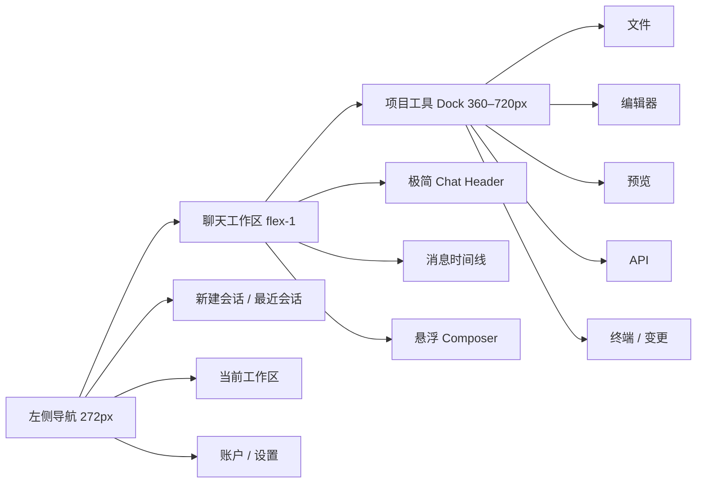

# Alibaba Copilot 前端 UI 重构方案

> 状态：新 AppShell 已切换并完成首轮构建/视觉验证；仍有清理、自动化测试与后端能力缺口
> 日期：2026-07-26
> 主项目：`F:\copilot\ui-react`
> 参考项目：`F:\ArcForge\crates\agent-gui`

## 1. 结论

本次采用“业务能力保留、可见 UI 全量替换”的方式重构：最终只保留一套新 UI，不提供旧版入口、UI 版本切换开关或双版本并存。

新界面沿用 ArcForge 的信息架构与视觉语言：左侧会话导航、中间聊天画布、右侧可折叠项目工具 Dock，以及独立的全屏设置页。当前项目已有的会话、AG-UI/SSE、模型、MCP、知识库、记忆、文件系统、WebContainer、CodeMirror、终端、预览和 API 测试能力继续使用；缺少后端支持的功能通过 capability adapter 显示真实的不可用态或开发 mock，并在 `backend-contracts.md` 中留下替换契约。

不会直接升级到 ArcForge 的 React 19、Vite 8、Tailwind 4 或 Tauri 运行时。目标项目继续使用 React 18、Vite 5 和 Tailwind 3，复制的是布局、token、交互模式和可复用的展示代码。

## 2. 设计依据

已核对以下本地材料，而不是仅参考 GitHub 首页：

- ArcForge 主题与动效：`src/index.css`
- ArcForge 主布局：`src/pages/ChatPage.tsx`
- ArcForge 侧栏：`src/components/chat/ChatHistorySidebar.tsx`
- ArcForge Composer：`src/pages/chat/components/ChatComposerBar.tsx`
- ArcForge 模型面板：`src/pages/chat/components/ChatModelPicker.tsx`
- ArcForge 项目工具 Dock：`src/components/project-tools/RightDockPanel.tsx`
- ArcForge 设置页：`src/pages/SettingsPage.tsx`
- Composer 对照截图：`design-qa-artifacts/*.png`
- 当前前端入口与聊天逻辑：`src/App.tsx`、`src/components/AiChat/chat/index.tsx`
- 当前 IDE 能力：`src/components/WeIde/**`、`src/components/EditorPreviewTabs.tsx`
- 当前服务边界：`src/api/**`、`src/stores/**`

ArcForge 仓库为 MIT License。若实质复制源码，将在项目中保留对应许可声明。品牌图标不复制；`OpenAISans-Semibold.woff2` 暂不复制，避免字体资产授权不清，默认使用系统字体栈。

## 3. 目标与非目标

### 目标

1. 完整替换当前顶部品牌 Header、悬浮式旧侧栏、旧消息气泡、旧输入框、Ant Design 设置弹窗和登录外观。
2. 将“聊天”和“开发工作台”从两个割裂区域统一成可组合的三栏工作台。
3. 把 1284 行的 `BaseChat` 拆为传输层、业务控制层和纯展示层，避免 UI 再次与 SSE、文件写入逻辑耦合。
4. 亮色/暗色使用同一组语义 token；不在组件内继续新增 `#18181a`、`#333333` 等散落颜色。
5. 所有加载、空数据、无模型、断线、失败和能力不可用状态都有明确界面。
6. 缺失后端能力可先完成前端，但 mock 只能位于 adapter 层，并能单点替换。

### 非目标

1. 本轮不把项目整体迁移到 Tauri，也不复制 ArcForge 的 Rust/Go 后端。
2. 不为了外观切换到 Monaco；当前 CodeMirror 和 WebContainer 能力继续保留。
3. 不直接复制 ArcForge 的完整 Agent、Skills、SSH、Tunnel、Scheduled 等业务实现。
4. 不在 UI 重构中改变现有认证协议、会话数据或 AG-UI 后端语义，除非是明确记录的接口补齐工作。

## 4. 新信息架构



### 桌面布局

- 左侧导航：展开宽度 `272px`，折叠为 `0`，与 ArcForge 一致，不保留窄图标栏。
- 中间聊天：最小宽度 `480px`，消息正文建议最大宽度 `768px`。
- 右侧 Dock：默认 `520px`，可拖拽范围 `360–720px`，宽度持久化到本地设置。
- Composer：最大宽度 `768px`，距底部 `16px`，圆角 `24px`，半透明表面、柔边框和双层阴影。
- 顶栏：约 `48–52px`，左侧只放侧栏开关，右侧只放主题、设置、Dock 开关；删除当前居中的渐变品牌标题。

### 响应式策略

- `>= 1440px`：三栏可同时出现。
- `1100–1439px`：右侧 Dock 默认较窄；用户仍可折叠任一侧栏。
- `768–1099px`：左侧栏和右侧 Dock 作为覆盖层，同一时间最多打开一个。
- `< 768px`：侧栏/Dock 全宽覆盖；设置页导航改抽屉；Composer 水平边距降为 `12px`。

## 5. 页面方案

### 5.1 左侧导航

结构从上到下为：

1. 品牌区：保留 `Alibaba Copilot` 自身品牌与图标，不复制 ArcForge 品牌素材。
2. 主操作：`新建会话`，使用 30–32px 高的轻量按钮。
3. 当前工作区：第一阶段映射现有单工作区；不伪造多项目后端。未来接入多项目 adapter 后可扩展为 ArcForge 的项目树。
4. 最近会话：支持选中态、重命名、删除、加载更多；搜索只在数据源支持时显示。
5. 底部：设置入口、账户头像/登录状态和退出动作。

会话项不再使用紫色整块高亮，改用 `foreground / 6%` 的中性底色。运行中的会话使用小状态点，不靠整行高饱和色提示。

### 5.2 聊天画布

- 空状态：居中品牌图形、时段问候和一句产品说明；无模型时显示直达“模型设置”的明确 CTA。
- 用户消息：右对齐，`16px` 主圆角 + 较小右下角，最大宽度约 85%，字体 14–14.5px。
- 助手消息：左侧小头像，正文不套大面积卡片；Markdown、代码、图片和工具结果分别使用内容组件。
- 操作区：复制、重试、编辑等动作只在 hover/focus 时出现，并保留键盘可达性。
- 流式状态：显示文本流、reasoning 折叠区、工具调用卡和文件变更，而不是当前单一转圈骨架。
- 消息滚动：Composer 作为底部覆盖层，时间线动态预留其高度，避免最后一条消息被遮挡。

### 5.3 Composer

闭合态固定为三个视觉锚点：

1. `添加`
2. `当前模型`
3. `发送/停止`

编辑区支持 `@` 文件引用、粘贴/拖拽附件、上下键历史提示和全高展开。发送过程中若暂不实现排队，输入框进入明确的 busy 状态；后续可在 adapter 支持后加入 ArcForge 的发送队列。

“添加”菜单映射当前产品能力：

- 上传图片/附件
- 引用工作区文件
- MCP 工具
- 知识库
- 提示词库/提示词优化
- 记忆开关
- Git（仅当 Git capability 可用；否则显示带原因的不可用态）

模型面板包含：

- 模型搜索与供应商分组
- `Chat / Builder` 执行模式，映射当前 `ChatMode.Chat / ChatMode.Builder`
- 推理等级和 Thinking 开关；后端未支持配置前由 capability 隐藏，而不是发送无效参数

菜单统一向 Composer 上方弹出，带碰撞检测；二级菜单横向展开，不覆盖父菜单。

### 5.4 右侧项目工具 Dock

以 ArcForge 的 Tab Strip + Launcher 为外壳，接入当前项目已有实现：

| Tab | 第一阶段实现 |
| --- | --- |
| 文件 | 复用 `WeIde` 文件树数据与文件服务，重写外壳和行样式 |
| 编辑器 | 保留 CodeMirror、未保存状态和标签页 |
| 预览 | 保留 `PreviewIframe` |
| API | 保留 `WeAPI` |
| 终端 | 保留 xterm + WebContainer，明确标注“浏览器沙箱终端” |
| 变更 | 基于现有 `oldFiles/files` 和 diff 工具展示生成文件变更 |
| Git | 前端面板先完成，真实 status/branch/diff/action 通过 `GitGateway` 接入；不可用时不假装成功 |

Dock 支持折叠、拖拽调整宽度、关闭 Tab、恢复上次打开的 Tab。移动端使用覆盖层。

### 5.5 设置页

设置从居中的 `1000 × 650` Ant Design 风格弹窗改为全屏应用内页面：

- 左侧 `224px` 分组导航
- 顶部返回聊天和当前章节标题
- 右下/左下显示自动保存状态：保存中、已保存、保存失败
- 内容区卡片使用轻边框和中性表面，避免大块阴影

导航分组：

- 通用：外观与语言、模型、提示词
- 智能能力：记忆、知识库、MCP
- 连接：后端地址、代理（桌面能力按环境显示）
- 其他：账户、关于

现有设置业务逻辑和 API 可复用，但所有表单控件重写为同一套 UI primitives。最终可见界面不混用 Ant Design。

### 5.6 登录与全局反馈

- 登录/注册/找回密码保留模态流程，但重做为 token 驱动的玻璃面板。
- Toast、确认框、错误提示统一成自有 primitives；移除 Ant Design message 与 react-toastify 两套并存。
- 危险操作使用二次确认 Popover/Dialog，并显示具体对象名称。

## 6. 视觉系统

### 颜色 token

以 ArcForge 的 HSL 语义 token 为基线，迁入 Tailwind 3：

| Token | Light | Dark | 用途 |
| --- | --- | --- | --- |
| `--background` | `0 0% 100%` | `224 22% 9%` | 主画布 |
| `--foreground` | `222.2 84% 4.9%` | `210 30% 96%` | 主文字 |
| `--sidebar-bg` | `220 14% 96%` | `224 22% 11%` | 左侧导航 |
| `--muted` | `210 40% 96.1%` | `220 18% 17%` | 次级表面 |
| `--muted-foreground` | `215.4 16.3% 46.9%` | `215 18% 76%` | 次级文字 |
| `--border` | `214.3 31.8% 91.4%` | `220 14% 26%` | 分隔与边框 |
| `--destructive` | `0 84.2% 60.2%` | `0 62.8% 36%` | 危险操作 |

另设聊天、工具卡、成功/运行/错误语义 token。品牌色只用于少量状态与 CTA，不再把紫色作为所有选中态的默认颜色。

### 字体、尺寸和表面

- 字体：`"Segoe UI Variable", "PingFang SC", "Microsoft YaHei", sans-serif`
- 基础字号：13–14px；辅助文字 11–12px；章节标题 16px；空状态标题 20–22px
- 控件高度：30–32px；大按钮 36px
- 圆角：8px 控件、12px 菜单项、16px 卡片、24px Composer
- 动画：150–220ms；高度展开 280ms；统一 `cubic-bezier(0.16, 1, 0.3, 1)`
- 所有动画尊重 `prefers-reduced-motion`
- 毛玻璃仅用于 Composer、Popover 和少量悬浮控件，普通内容卡不滥用 blur

## 7. 前端架构

推荐新目录：

```text
src/
  app/                 # AppShell、页面状态、全局 Provider
  components/ui/       # Button、Dialog、Dropdown、Input、Toast、ScrollArea
  features/navigation/ # 左侧栏与会话列表
  features/chat/
    components/        # Header、Transcript、Message、Composer
    controller/        # useChatController、发送/停止/历史加载
    transport/         # AG-UI SSE 解析和 UiMessagePart 标准化
  features/workbench/  # 右侧 Dock 及 Files/Editor/Preview/API/Terminal/Changes/Git
  features/settings/   # 设置壳与各 section
  features/auth/       # 登录注册界面
  services/            # 现有 API 的 gateway/adapter
  stores/              # 保留并逐步整理 Zustand store
  styles/              # tokens、motion、markdown、editor bridge
```

关键约束：

1. 展示组件不能直接 `fetch`。
2. AG-UI parser 输出统一的 `UiMessagePart`，UI 不再直接判断原始 SSE 字符串。
3. 文件写入副作用留在 controller/service，不放进消息组件。
4. `mock`、`local`、`real` adapter 实现同一接口，组件不知道数据来源。
5. AppShell 只管理页面与面板布局，不承载模型、SSE 或文件业务。

## 8. 复制与改造边界

### 可复制后改造

- ArcForge 的 light/dark token、Composer 几何和玻璃表面样式
- Button/Input/Textarea 的 class 结构
- Sidebar、Settings、Right Dock 的布局骨架
- Popover/Menu 的动效和碰撞策略
- Chat 空状态、用户气泡、工具卡的视觉结构

### 必须重写或只借鉴

- `MentionComposer.tsx`：其 3600+ 行实现绑定 ArcForge 的 Skills/Git/附件模型，当前项目应复用自身 mention 数据并重写精简版
- `ChatPage.tsx`：绑定 Tauri、Gateway、Agent runtime，不能直接迁入
- `RightDockPanel.tsx`：保留外壳模式，内容接入当前 WeIde/WebContainer
- `SettingsPage.tsx` 各 section：只复制页面壳，表单逻辑映射现有 API
- `components/ui/dropdown-menu.tsx`：ArcForge 使用 Base UI/React 19；当前项目采用 React 18 兼容的 Radix primitives 或本地实现

## 9. 验收标准

1. 运行时只存在新 AppShell；旧 Header、Sidebar、ChatInput、Settings 外观无入口。
2. 登录/未登录会话、历史切换、新建、重命名、删除均正常。
3. 模型选择、Chat/Builder、发送、停止、重试、附件、文件引用正常。
4. AG-UI 文本、reasoning、工具调用、工具结果、错误和完成状态可见且不会重复。
5. Builder 下的文件树、编辑器、预览、API、终端、变更面板可用。
6. 模型、MCP、知识库、记忆、提示词、语言、主题设置可用。
7. 亮/暗主题无硬编码漏色；`1280 × 720`、`1440 × 900`、`1920 × 1080` 无溢出。
8. 键盘可操作菜单、Dialog 和 Composer；焦点可见；ESC 行为一致。
9. TypeScript、Vite build 和关键交互测试通过；核心页面完成截图对比。
10. 生产构建中没有散落 mock；能力不可用时展示真实原因。

## 10. 当前实施状态

2026-07-26 已将运行入口一次切换到新 AppShell，未设置“旧版/新版”功能开关。当前实现并不等于第 9 节验收标准已全部满足；完成项、未完成项与验证范围以 `migration-checklist.md` 为准，后端占位能力与运行环境边界以 `backend-contracts.md` 为准。具体文件映射、接口缺口和阶段清单分别见：

- `component-mapping.md`
- `backend-contracts.md`
- `migration-checklist.md`
